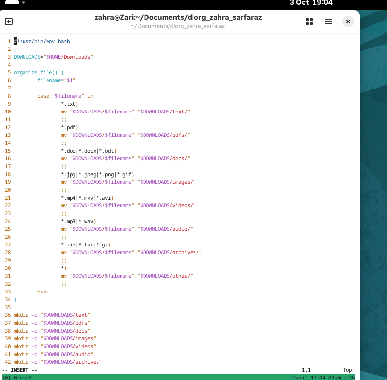
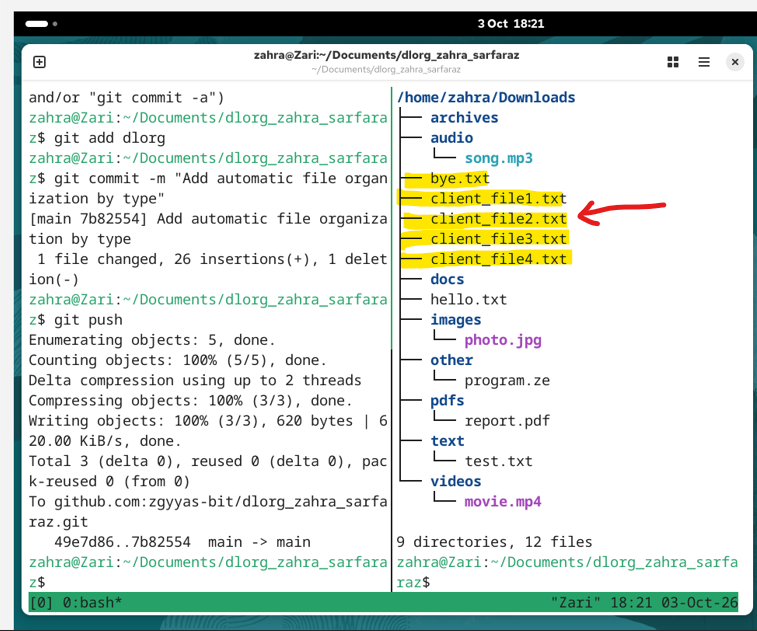
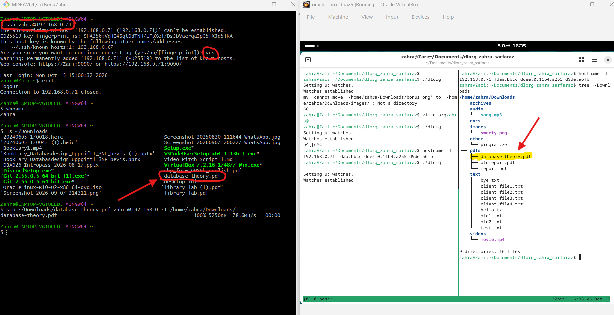
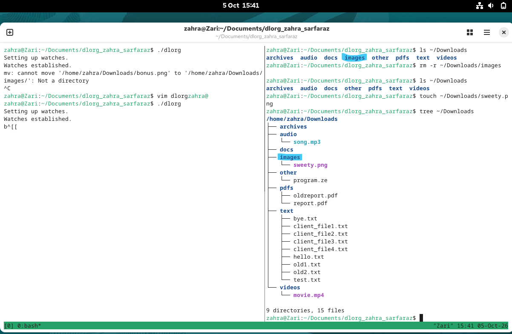
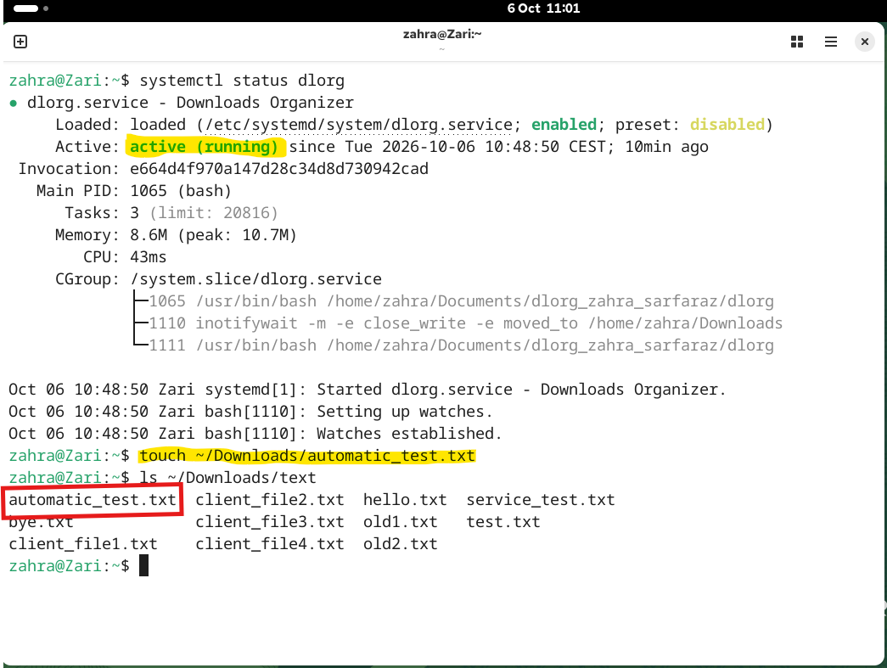

# dlorg - Downloads Organizer


## Beskrivning

dlorg är en Bash-script skapad för att automatisk organiserar filer i Linux Downloads directory (mappen) baserad på typ av fil (text, bild, ljud, video etc...). Genom att använda sig av inotifywait kan scriptet övervaka Download mappen och upptäcka alla nya, namn-bytta eller flyttade filer och överföra dem till rätt mapp. 

## Funktioner

- Sorterar nya filer automatiskt i Downloads
- med en extra tweak organiserar dlorg även filer som fanns i Downloads sedan tidigare.
- filerna fördelas i olika mappar som till exempel: text, pdfs, docs, images, videos, audio, archives and other.
- Dlorg's uppsikt över Downloads-mappen är kontinuerligt med hjälp av 'inotifywait'.
- Vid fallet av en raderad kategorimapp, återskapar scriptet en ny mapp när det behövs.
- Dlorg kan köras automatiskt och framgångsrikt i bakgrunden som en 'systemd' service. 

## Hur det fungerar

Dlorg scriptet kan startas manuellt i bash med './dlorg'.
vid start sorteras först filer som redan finns i Downloads, där de förflyttas till rätt kategorimapp, därefter håller den uppsikt över Downloads-mappen kontinuerligt via 'inotifywait' och organiserar alla nya filer automatiskt genom en `case`-sats. till exempel:

report.pdf -> pdfs/
photo.jpg  -> images/
notes.txt  -> text/
movie.mp4  -> videos/

Bilden nedan visar `organize_file()`-funktionen där en `case`-sats används för att sortera filer baserat på filtyp.


## Installation

första steget var att skapa en ny repository (dlorg_zahra_sarfaraz) på Github och sedan klona det till oracle Linux VM. 

```bash
git clone <repository-url>
cd dlorg_zahra_sarfaraz
```

Eftersom 'inotify-tools' var redan installerd sedan tidigare kom den i användning direkt i dlorg.  

Kontroller gjordes för att ge scriptet rätt behörighet:
```bash
 chmod +x dlorg
```
Scriptet kunde sedan startas manuellt med './dlorg' på bash för att starta övervakningen av Downloads mappen. scriptet stoppas med 'Ctrl + c'.


## Testing

flertal tester har gjorts för att kontrollera att scriptet hanterar filerna korrekt:
```bash
touch ~/Downloads/test.txt
touch ~/Downloads/Photo.jpg
touch ~/Downloads/report.pdf
```
Testerna visar att filer av olika typer automatiskt flyttas till rätt kategorimapp.Se bild. 


Scriptet testades även genom att flytta filer till Downloads och genom att överföra en riktig PDF-fil från Windows host computer till Linux VM med securecopy 'scp'.Se bilden nedan.


Som bonustest har scriptet även testats när en kategorimapp 'images' raderades. Mappen skapas då på nytt automatiskt av dlorg när en fil, i det här fallet 'sweety.png' upptäcks och så flyttas filen dit.Se bilden nedan.  


## Systemd-Service

Dlorg vidareutvecklades till ett systemd-service. Med det menas att scriptet kan köras automatiskt i bakgrunden så fort Oracle Linux startar och man behöver ej ha ett terminalfönster öppet med './dlorg'. 
Servicens status kan kontrolleras med:
 
```bash
systemctl status dlorg. 
```


Som det syns på bilden, efter omstart av VM kontrollerades servicen med systemctl status dlorg. Statusen visar enabled och active (running). testfilen automatic_test.txt flyttades automatiskt till text, vilket visar att dlorg fungerar utan att startas manuellt. 


